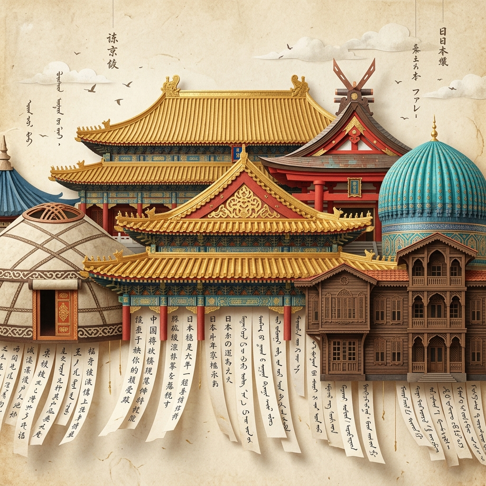

<div align="center">

# 🏛️ W H I S P E R I N G &nbsp; E A V E S
### *听檐 / 囁く庇 / Сыбырлаған Шатырлар / Fısıldayan Saçaklar*

**A Single-File Interactive Web Exhibition & Verlet Physics Art Work Inspired by the Silk Road Heritage**

[](https://github.com/kutluhangil/Whispering-Eaves)

[](https://github.com/kutluhangil/Whispering-Eaves)
[](https://github.com/kutluhangil/Whispering-Eaves)
[](https://github.com/kutluhangil/Whispering-Eaves)
[](https://github.com/kutluhangil/Whispering-Eaves)

---

</div>

## 📖 Overview

**WHISPERING EAVES** is a single-file, full-screen interactive web artwork that fuses architectural heritage with real-time cloth physics. Inspired by historical building eaves and traditional text curtains (*noren* / *fengling*), the artwork invites visitors on a spatial journey across five pivotal cultures of the ancient Silk Road: **China**, **Japan**, **Kazakhstan**, **Uzbekistan**, and **Türkiye**.

Written in native **HTML5 Canvas**, **Vanilla CSS**, and **Web Audio API**, the application requires **no build step, no npm packages, and no external frameworks**.

---

## 🎨 Cultural Destinations & Architecture

| # | Destination | Architectural Eaves | Script & Glyph System | Atmospheric Soundscape |
|---|-------------|---------------------|-----------------------|------------------------|
| **01** | **China (Xi'an)** | Golden Palace Eaves & Interlocking Dougong Brackets (斗拱) | Classical Chinese Characters (汉字) | Guzheng Pentatonic Zither (261Hz – 523Hz) |
| **02** | **Japan (Nara)** | Vermilion Shinto Shrine Roof & Hip-and-Gable Irimoya (入母屋造) | Japanese Kanji & Hiragana (ひらがな) | Koto Traditional Scale (293Hz – 587Hz) |
| **03** | **Kazakhstan (Altay)** | Nomadic Felt Yurt & Central Sky Ring Shanyrak (Шаңырақ) | Kazakh Cyrillic & Turkic Runes (Руналар) | Dombra Twin-String Folk Scale (220Hz – 440Hz) |
| **04** | **Uzbekistan (Samarkand)** | Registan Vaulted Iwan & Cobalt Glazed Tiles | Uzbek Calligraphy & Oriental Motifs | Samarkand Oud & Sitar Scale (261Hz – 466Hz) |
| **05** | **Türkiye (Istanbul)** | Ottoman Bosphorus Mansion & Lead-Clad Dome (Alem) | Ottoman Turkish & Rumi Motifs | Kanun & Ney Pentatonic Melodies (220Hz – 392Hz) |

---

## ✨ Key Exhibition Features

```
               ┌─────────────────────────────────────────┐
               │         WHISPERING EAVES ENGINE         │
               └────────────────────┬────────────────────┘
                                    │
    ┌─────────────────┬─────────────┴─────────────┬─────────────────┐
    │                 │                           │                 │
┌───▼───────────┐ ┌───▼───────────┐         ┌─────▼───────────┐ ┌───▼───────────┐
│ Verlet Cloth  │ │ 3D WebGL      │         │ Seasonal        │ │ Web Audio     │
│ Text Physics  │ │ Artifacts     │         │ Weather Engine  │ │ Pentatonic    │
└───────────────┘ └───────────────┘         └─────────────────┘ └───────────────┘
```

### 1. 🧵 Verlet Physics Text Curtain
- **Interactive Cloth Simulation:** 2D grid of mass points connected by distance constraints.
- **Gesture Drag & Scattering:** Pointer swipes part, stretch, rotate, and scatter characters with elastic spring recovery.
- **Custom Text Customizer:** Live text input field generates real-time custom text curtains.

### 2. 🏺 3D WebGL Cultural Artifact Inspector
- Interactive 3D wireframe models rendered directly on canvas with real-time mouse drag rotation:
  - **China:** Tang Dynasty Tricolor Terracotta Horse (*Tang Sancai*)
  - **Japan:** Iron Sword Guard (*Tsuba*) & Cedar Torii Gate
  - **Kazakhstan:** Ceremonial Golden Warrior Crown (*Altty Adam*)
  - **Uzbekistan:** Turquoise Samarkand Registan Glazed Amphora
  - **Türkiye:** Fifteenth-Century Iznik Floral Tile Pitcher

### 3. 🎙️ Native Poetry Recitation Engine
- Original poetry recitations paired with native speech synthesis voiceovers:
  - **Li Bai (李白)** — *Quiet Night Thought / Jade Pass Breeze*
  - **Matsuo Bashō (松尾芭蕉)** — *The Ancient Pond Haiku*
  - **Abay Kunanbayev (Абай Құнанбайұлы)** — *Steppe Wisdom Verses*
  - **Alisher Navoi (Алишер Навоий)** — *Samarkand Friendship Ghazal*
  - **Yunus Emre** — *Biz Gelmedik Dava İçin*

### 4. 🎹 Keyboard Instrument Synthesizer
- Press keys `1-9` or `A-K` on your keyboard to trigger real-time regional chime notes and create physical waves across the text curtain.

### 5. 🗺️ Interactive Silk Road Vector Route Map
- Visual map overlay charting caravan routes from Xi'an to Istanbul with instant teleportation nodes.

### 6. 📸 High-Resolution Poster Exporter
- Export current frame, paper texture, roof artwork, and editoryal typography as a downloadable 1848×1080 PNG poster.

---

## ⌨️ Keyboard Shortcuts Map

| Key | Action |
|-----|--------|
| <kbd>Z</kbd> | Toggle **Zen Mode** (hides UI chrome for immersive viewing) |
| <kbd>1</kbd> – <kbd>9</kbd> | Play **Pentatonic Instrument Notes** (Left to Right pitch) |
| <kbd>A</kbd> – <kbd>K</kbd> | Play **Atmospheric Chime Melodies** |
| <kbd>Esc</kbd> | Close active modal or exit gallery view |
| <kbd>Space</kbd> / <kbd>Enter</kbd> | Activate focused interactive button |

---

## 🛠️ Quick Installation & Setup

1. **Clone the Repository:**
   ```bash
   git clone https://github.com/kutluhangil/Whispering-Eaves.git
   cd Whispering-Eaves
   ```

2. **Launch Local HTTP Server:**
   ```bash
   python3 -m http.server 5173 --directory silk-atlas
   ```

3. **Open in Browser:**
   Navigate to [`http://localhost:5173`](http://localhost:5173) in Chrome, Safari, Firefox, or Edge.

---

<div align="center">

**WHISPERING EAVES** — *Crafted with passion for Silk Road digital heritage & modern web art.*

</div>
