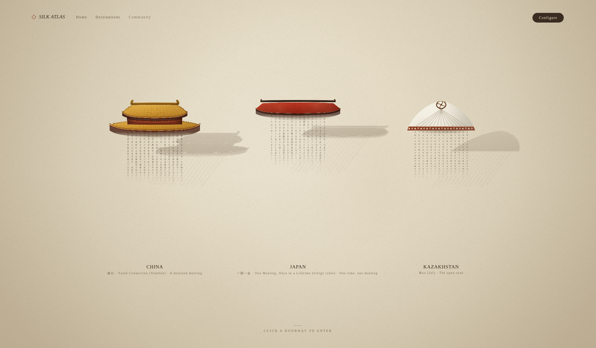

<div align="center">


<p>
  <a href="https://whispering-eaves.vercel.app/"></a>
  
  
  
</p>

<p><em>听檐 · 囁く庇 · Сыбырлаған Шатырлар · Fısıldayan Saçaklar<br>
A full-screen web artwork where curtains of text hang from historic eaves and move like real cloth.</em></p>

<a href="https://whispering-eaves.vercel.app/"></a>

</div>


## The exhibition

Whispering Eaves fuses architectural heritage with real-time cloth physics. Inspired by building eaves and traditional text curtains (*noren*, *fengling*), it takes you on a journey across five cultures of the ancient Silk Road. Swipe the curtain and the characters part, stretch and scatter, then spring back.

It is written in plain HTML5 Canvas, CSS and the Web Audio API: no build step, no npm packages and no frameworks.

| # | Destination | Eaves | Script | Sound |
|---|---|---|---|---|
| **01** | China · Xi'an | Golden palace eaves and interlocking dougong brackets | Classical Chinese characters | Guzheng pentatonic zither |
| **02** | Japan · Nara | Vermilion shrine roof, hip-and-gable irimoya | Kanji and hiragana | Koto scale |
| **03** | Kazakhstan · Altay | Felt yurt and the shanyrak sky ring | Kazakh Cyrillic and Turkic runes | Dombra twin-string folk scale |
| **04** | Uzbekistan · Samarkand | Registan iwan and cobalt glazed tiles | Uzbek calligraphy and motifs | Oud and sitar scale |
| **05** | Türkiye · Istanbul | Bosphorus mansion and lead-clad dome | Ottoman Turkish and rumi motifs | Kanun and ney melodies |

<table>
  <tr>
    <td width="33%"></td>
    <td width="33%"></td>
    <td width="33%"></td>
  </tr>
  <tr>
    <td align="center"><code>02</code> · Nara</td>
    <td align="center"><code>03</code> · Altay</td>
    <td align="center"><code>gallery</code> · the five stops</td>
  </tr>
</table>


## What you can do

| | |
|---|---|
| **Text curtain** | A Verlet grid of mass points and distance constraints. Swipes part, rotate and scatter the glyphs; type your own text and a new curtain is woven live. |
| **Artifact inspector** | Wireframe 3D artifacts from each culture, rotated with the pointer. |
| **Poetry recitation** | Original poems with speech-synthesis voiceovers. |
| **Keyboard instrument** | Regional chime notes that send physical waves across the curtain. |
| **Silk Road map** | Caravan routes from Xi'an to Istanbul, with nodes that teleport you to each stop. |
| **Seasons and weather** | A weather engine that changes the mood of every scene. |
| **Poster export** | The current frame, paper texture, roof artwork and typography as a 1848 × 1080 PNG. |

| Key | Action |
|---|---|
| <kbd>Z</kbd> | Zen mode: hide the interface |
| <kbd>1</kbd> – <kbd>9</kbd> | Pentatonic notes, left to right |
| <kbd>A</kbd> – <kbd>K</kbd> | Atmospheric chimes |
| <kbd>Esc</kbd> | Close a modal or leave the gallery |


## Türkçe özet

**Fısıldayan Saçaklar (Whispering Eaves)**, tarihi saçaklardan sarkan yazı perdelerini gerçek kumaş fiziğiyle hareket ettiren, tam ekran bir web sanat eseri. İpek Yolu boyunca beş durak var: Şian, Nara, Altay, Semerkant ve İstanbul. Her durağın kendi mimarisi, yazısı ve pentatonik müziği var. Perdeyi kaydırınca harfler dağılıp esnek biçimde geri toplanıyor. Kendi metninle perde örebilir, klavyeyle nota çalabilir, sahneyi poster olarak indirebilirsin. Derleme adımı ya da kütüphane yok; tek bir HTML dosyası.


## Running locally

```sh
python3 -m http.server 8080 --directory silk-atlas
# http://localhost:8080
```

```
silk-atlas/      the artwork: index.html and its roof, artifact and texture assets
assets-src/      source artwork before optimisation
tests/           Playwright probes for physics, transitions and images (Python)
shots/           screenshots from the test runs
```

<div align="center">
<br>
<a href="https://github.com/kutluhangil"></a>
<sub>Five cultures, one curtain · every poem, motif and melody written for this piece.</sub>
</div>
